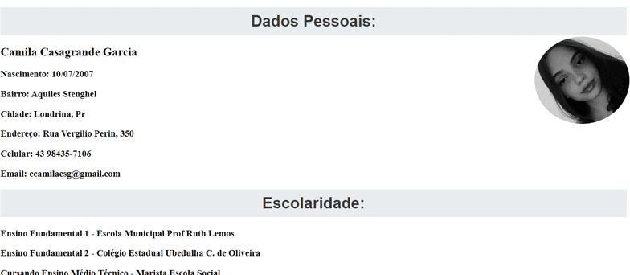

# Currículo 

* [Descrição](#descri%C3%A7%C3%A3o)
* [Tecnologias utilizadas](#tecnologias-utilizadas)

## Descrição
Projeto de currículo utilizando HTML e CSS, junto com as matérias de FDW, Língua Portuguesa e Projeto de Vida, onde cita nossas Hard Skills e Soft Skills.

### Tecnologias utilizadas 
HTML5 e CSS

